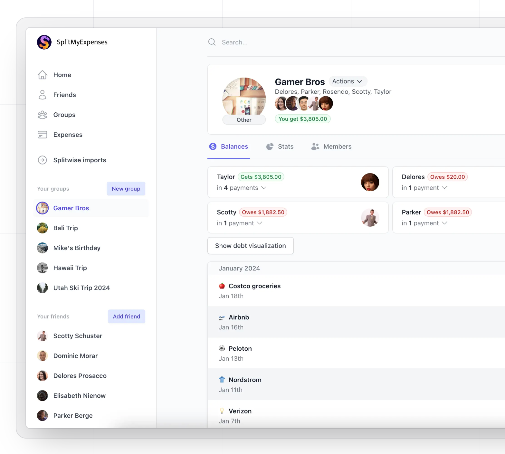

# voyage-project-tier2-expense-splitter

## Table of Contents

* [Overview](#overview)
* [General Instructions](#general-instructions)
* [Requirements & Specifications](#requirements-specifications)
* [Acknowledgements](#acknowledgements)
* [About Chingu](#about-chingu)

## Overview

Welcome, Chingus!

Are you ready to simplify the way you split expenses with friends, family, or roommates? Experience the convenience of managing shared costs effortlessly.

From casual dinners to group vacations or birthday parties, splitting expenses has always been a part of our social interactions. Over time, the need for an efficient and fair way to manage shared costs has grown, especially in our increasingly interconnected world.

In this voyage, your team will create a user-friendly expense splitting application that takes the headache out of shared finances. Get ready to combine your problem-solving skills and creativity to build a tool that makes group expense management a breeze!

Happy splitting!

## General Instructions

This project is designed to be worked on by a team rather than an individual
Chingu. This means you and your team will need to thoroughly read and
understand the requirements and specifications below, **_and_** define and
manage your project following the _Agile Methodology_ defined in the
[Voyage Handbook](https://github.com/chingu-voyages/Handbook/blob/main/docs/guides/voyage/voyage.md#voyage-guide).

As you create this project make sure it meets all of the requirements, but once
it reaches MVP, start implementing the optional features or get creative and
extend it in ways we haven't envisioned. In other words, use the power of
teamwork to make it distinctive and unique.

Take note that we haven't given specific direction on what your UI/UX should
look like. This is another area where you and your team can put your creativity 
to work! 

## Requirements & Specifications

### What You Need to Do

The following define the minimum requirements and ideas for features you may
implement to enhance this app, if time permits.

#### Structure

- [ ] This is a purely frontend application. No backend is required.
- [ ] You may use any languages, tools, or libraries you prefer when designing and building this app.
- [ ] You may **_NOT_** use AI-based solution generators like GitHub Copilot.
- [ ] Implement cloud storage for storing receipts using one of the providers in the list below or one of your own choice:
    - [Firebase Firestore](https://firebase.google.com/docs/storage/web/upload-files) has free storage buckets for up to 5GB storage, 50k/day download operations, 20k/day upload operations but limited to only one free bucket per project
    - [Amazon S3](https://aws.amazon.com/s3/?did=ft_card&trk=ft_card) offers a 12 months free trial for 5GB, 20k Get requests, 2000 put requests
    - [Cloudinary](https://cloudinary.com/documentation/frontend_sdks) has a free tier for 3 users per account and up to 25GB of storage

#### Styling

- [ ] Surprise us!!! Use your team's creativity to make this app distinctive.
- [ ] Add a footer containing a link to your team's GitHub repo.
- [ ] In general, you will find these [UI design principles](https://www.justinmind.com/ui-design/principles) helpful.
- [ ] Recommend using this resource for [clean CSS](https://israelmitolu.hashnode.dev/writing-cleaner-css-using-bem-methodology).

#### Functionality
- Overview

  - [ ] Develop a single-page application (SPA) that simulates an expense splitting system.

- Expense Group Management

  - [ ] Users should be able to create one or more expense groups with the following details:
    - Group ID
    - Group Name
    - Group Description
    - Group Alloted Budget: the budget allocated for the particular group activity
  - [ ] Ability to add/update/remove member/participant to expense group utilizing
    - Member/Participant ID
    - Member/Participant Name
  - [ ] Users should be able to choose, for a particular participant, the weight of their contribution to the total expense
    - E.g: If a user decides to cover 40% of the total expense for a group dinner, they can specify their contribution as 40%. The remaining 60% will be distributed equally among the other participants.
    - The weight of the contribution should be set to 0 by default (every participant contributes equally)
  - [ ] Users should be able to edit the details of an expense group, except for Group ID
  - [ ] Users should be able to remove a particular expense group

- Expense Management

  - [ ] Add expenses with the following details:
    - Name of expense
    - Description
    - Category/type of expense (e.g: birthday, dinner, concert, ... )
    - Amount
    - Participant name
    - Date (captured automatically)
    - The % contribution of the participant to the expense: 
      - 0 (default) means the expense will be divided equally among all members of the group
      - Value between 1 & 100 with a step size of 10 (10, 20, 30…) means that the participant chooses how much of the expense they will cover individually in the group
        - E.g: an expense of 50 dollars, user can choose to cover 50% of the expense. This means that only 25 dollars will be added to the total group expense
    - Receipt proof
      - Upload a photo/other format of the receipt to the expense group (see details in Receipt section)
  - [ ] User should be able to edit and delete an existing expense (Date should remain Immutable)

- Calculations

  - [ ] Automatically calculate and display who owes what to whom within the group and taking into account the weighted contributions of a participant or the weighted contribution of a participant to an individual expense
  - [ ] Update calculations in real-time as expenses are added, modified, or deleted

- Receipts
  
  - [ ] User creating an expense can choose to upload a proof of expense or a receipt. The receipt can be a photo or a pdf or whatever other format of your choice
  - [ ] The receipt should be available/visible at the group level, as well as at the expense level
  - [ ] For storage, an external third party can be used from the list available in the Structure section
    

- Summary and Visualization

  - [ ] Provide a summary view of total group expenses and individual balances for each participant in the group
  - [ ] Implement simple charts or graphs to visualize expense distribution (e.g can be a bar chart which shows each participant expenses in relation to the average owed amount of the group)

- Analytics

  - [ ] Implement at least one chart among the following:
    - Total Expenses By Expense Category
      - at multiple expense groups level
    - Line graph with expenses per date or date range
      - at expense group level
      - at multiple expense groups level
    - Total expenses vs allotted budget
      - at multiple expense groups level

- Data Persistence

  - [ ] Implement local storage to save expense group data in the browser
  
  - [ ] Add ability to export data (e.g., PDF, Excel or as a chart)

  
- User Interface and Experience

  - [ ] Ensure the application provides a seamless user experience for managing expenses and viewing balances
  - [ ] Implement intuitive UI/UX elements to guide users through the expense splitting process
  - [ ] Use responsive design techniques to ensure the application is accessible and functional across various devices and screen sizes

### Extras (Not Required)

- Multi-currency Support

  - [ ] Allow expenses in multiple currencies

## Acceptance Criteria

- Expense Group Management

  - [ ] Each group can have multiple members
  - [ ] One or more expense groups can be created with a specific budget
  - [ ] A participant in an expense group can have a particular weighted contribution to the total amount
  - [ ] An expense group can be edited and deleted
  - [ ] One or more receipt proofs can be consulted 

- Expense Management

  - [ ] Users can add new expenses with all required details
    - Name of expense
    - Description
    - Amount
    - Participant name
    - Date (captured automatically)
    - Category
    - % Contribution
    - Receipt proof
  - [ ] Existing expenses can be edited and deleted
  - [ ] Date of expense is automatically captured
  - [ ] The receipt proof of an expense can be consulted

- Calculations

  - [ ] The app accurately calculates balances within the group according to the weighted contribution of some participants
  - [ ] Calculations update in real-time when expenses change

- Summary and Visualization

  - [ ] Users should be provided with a clear summary of total expenses and individual balances.
  - [ ] Users can view a chart with the distribution of expenses within a group

- Data Persistence

  - [ ] Expense data persists across browser sessions using local storage
  - [ ] Receipt proofs can be consulted at any moment when viewing the details of an expense or when viewing the details of a group expenses. A receipt proof can be viewed as attached to an expense/expense group and the actual receipt can also be viewed

- Analytics

  - [ ] One or more analytics chart are available for consultation

- User Interface and Experience

  - [ ] The application provides an intuitive and seamless user experience
  - [ ] Responsive design ensures functionality across various devices and screen sizes

- Export Functionality
  - [ ] Users should have the ability to export the data as (e.g., PDF, Excel, Chart)

## Acknowledgements

We extend our heartfelt gratitude to the wider developer community, whose invaluable insights and expertise consistently inspire and elevate our projects. We are also deeply thankful for the powerful tools and services provided by [Google](https://google.com), [Cloudinary](https://cloudinary.com), and [AWS](https://aws.amazon.com), which play a crucial role in making our journey possible. Your contributions and innovations drive our success, and for that, we are sincerely grateful.

## About Chingu

If you aren't yet a member of Chingu we invite you to join us. We help our
members transform what they've learned in courses & tutorials into the
practical experience employers need and want.
